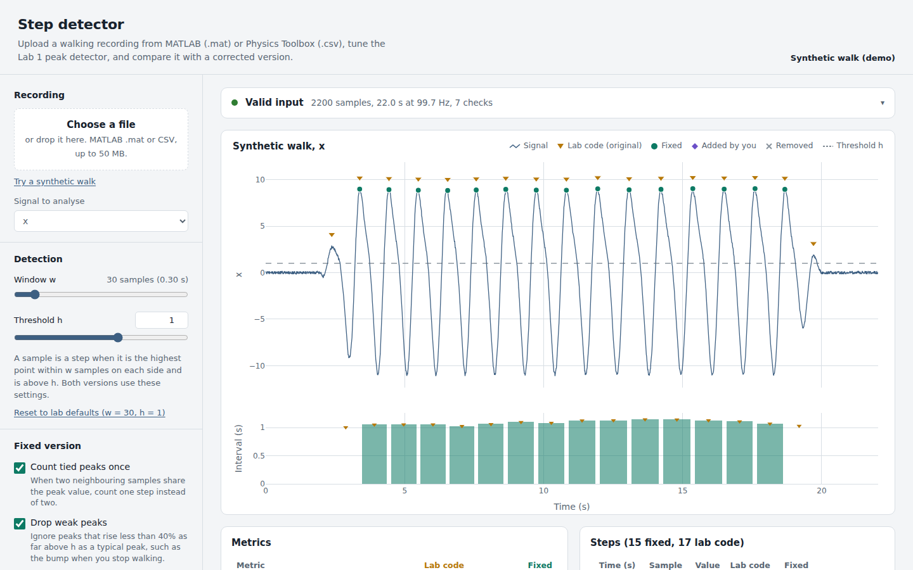

# Step detector

A browser dashboard and a Python port of the step-detection code from Lab 1 of
*Wearable Devices for Sport, Health, and Wellness* (ASU, Fall 2026).

Upload a MATLAB `.mat` file or a [Physics Toolbox Sensor Suite](https://play.google.com/store/apps/details?id=com.chrystianvieyra.physicstoolboxsuite)
CSV export. The dashboard checks that the file is usable, runs the lab's peak
detector, and shows it next to a corrected version. You can then tune the settings,
fix individual steps by hand, and export the results.



## Features

- **Upload** `.mat` files (MATLAB/Octave v5–v7, any variable name, structs searched)
  or CSV files (Physics Toolbox G-Force, Linear Accelerometer, Gyroscope and Multi
  Record exports, comma or semicolon separated, elapsed or clock time).
- **Validation.** Every file is checked against an [input schema](docs/schema.md)
  before analysis. Problems come with a concrete fix, such as the exact MATLAB line
  to re-save a v7.3 file.
- **Live sliders** for the window `w` and threshold `h`.
- **Lab code vs fixed version**, compared on the same plot and metrics table. The
  fixed version counts tied peaks once, drops start/stop artefacts, uses real
  timestamps, and reports cadence; it can also treat each peak as a stride.
  See [docs/algorithm.md](docs/algorithm.md).
- **Click-to-edit.** Add, remove and restore steps on the plot, with undo.
- **CSV export** of the steps (both versions, with the reason each step was dropped)
  and of the metrics (with all settings used).
- **Private.** Files are processed in the browser and never uploaded.

## Run it

The dashboard is a static page with no build step.

```bash
python3 -m http.server 8000     # or: npm run serve
# open http://localhost:8000
```

Opening `index.html` directly from disk also works. Plotly and pako load from the
jsDelivr CDN, so an internet connection is needed.

**To publish it for classmates:** in the GitHub repo, go to *Settings → Pages* and
deploy from the `main` branch, root folder. The page will be at
`https://<user>.github.io/<repo>/`.

## Python port

`python/lab_step_det.py` is a 1:1 translation of `LabStepDet_2025.m`.

```bash
uv sync                          # once per clone: creates .venv from uv.lock (Python ≥ 3.12)
python python/lab_step_det.py --file data/Walking.mat --col 2
python python/plot_walking.py data/Walking.mat --out walking_steps.png
```

## Tests

```bash
npm install && npm test          # parsing, validation, algorithms, UI (jsdom)
uv run pytest                    # Python port
python scripts/make_fixtures.py  # regenerate tests/fixtures after changing the port
bash scripts/octave_parity.sh    # original .m in GNU Octave vs the Python port
```

All fixtures are generated from a synthetic walk. The course files (`Walking.mat`,
`LabStepDet_2025.m`) are **not** committed. If you put them in `data/`, the
MATLAB-parity tests run as well; otherwise they are skipped.

## Layout

```
index.html            dashboard page
src/core.js           parsing, validation and detection (no DOM; also runs in Node)
src/app.js            dashboard UI: controls, Plotly figure, edits, export
src/styles.css        light and dark themes
python/               Python port and plotting script
tests/                Node and pytest suites, generated fixtures
scripts/              fixture generator, Octave parity check
docs/                 input schema and algorithm notes
data/                 local course files (git-ignored)
```

## Notes

- The algorithm is a port of course material provided by the instructor. Check the
  course policy before making this repository public.
- MATLAB v7.3 files (HDF5) are not supported in the browser; re-save with `-v7`.
