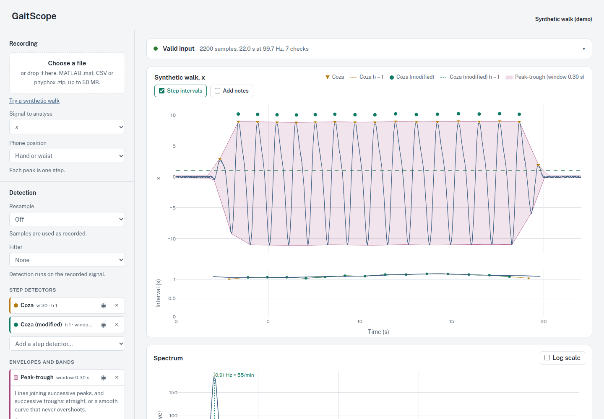

# GaitScope

Step detection and gait metrics from phone accelerometer recordings, in the browser.

**[Open GaitScope](https://soroushdianaty.com/gaitscope/)**. There is nothing to install, and
your files never leave the browser.

GaitScope started in Fall 2026 as a lab of BME 598/494 *Wearable Devices for Sport,
Health, and Wellness* (ASU, Dr. Aurel Coza): a MATLAB step detector and a sample walk. It
is now a dashboard that
loads or records a walk, checks that the file is usable, and puts any number of step
detectors and envelopes on the plot side by side, with filters, a spectrum, gait metrics
and exports. A Python port of Coza's detector gives exactly the same steps as MATLAB.



## What it does

### Bring a walk

- **Upload** a MATLAB `.mat` file (MATLAB or Octave, v5 to v7.3, any variable name,
  structs searched), a [Physics Toolbox Sensor Suite](https://play.google.com/store/apps/details?id=com.chrystianvieyra.physicstoolboxsuite)
  CSV export (G-Force Meter, Linear Accelerometer, Gyroscope or Multi Record; comma or
  semicolon separated; elapsed or clock time), a [phyphox](https://phyphox.org) export zip
  ("Acceleration with g" or "without g"), or any CSV with numbers in columns.
- **Record a walk** on a phone with the browser's motion sensors, with no app to install.
  Tap Record, walk, then hold to stop. The page asks how many steps you counted and where
  the phone was, and compares your count with the detectors. The recording downloads as a
  CSV that both the dashboard and the Python port read. It needs https (the live page has
  it) and the screen on. So far it has been tested with emulated sensors; the checks on
  real phones are in [#51](https://github.com/soroushdty/gaitscope/issues/51).
- **Validation.** Every file is checked against an [input schema](docs/schema.md) before
  analysis. Each problem comes with a concrete fix, such as the exact MATLAB line to re-save
  a file in a format the page can read.

### Prepare the signal

- **Signal to analyse:** x, y, z or the magnitude. When the recording includes gravity,
  also the vertical (along gravity) and horizontal (across it) acceleration.
- **Resample** to a rate you choose, or just even out a phone's uneven timing, before
  anything else runs. This is linear (like MATLAB `interp1`) or monotone cubic, with an
  optional anti-aliasing low-pass. It matches the Python port's `--resample` bit for bit,
  so Coza finds the same steps in both.
- **Filter:** Butterworth, Bessel, Chebyshev I and II, and elliptic (low-pass or band-pass,
  order 2 to 6), moving average, median, Savitzky–Golay, wavelet denoising (Daubechies-4)
  and notch. Each matches scipy (or PyWavelets) within 1e-9. Every detector and envelope
  can use either the filtered or the recorded signal.

### Detect steps

- **Step detectors and envelopes as chart indicators.** Put any number on the plot at
  once, in any mix, like indicators on a trading chart. Each has its own settings, colour,
  source signal, show/hide and remove, and gets its own metrics column.
  - **Coza:** the step detector from BME 598/494 *Wearable Devices for Sport, Health, and
    Wellness* (ASU, Dr. Aurel Coza), exactly as written, bugs included.
  - **Coza (modified):** the same detector with its bugs fixed. It counts tied peaks once,
    drops start/stop artefacts, uses real timestamps, and reports cadence.
  - **Threshold peaks, Peak-to-valley and Zero-crossing:** three textbook detectors.
  - **Envelopes and bands:** sliding window, peak-trough, dynamic threshold, mean ± k·SD,
    Hilbert envelope and percentile band. They are a view only and never change the steps.

  The page opens with Coza beside Coza (modified). How each one works, and what is wrong
  with Coza's code, is in [docs/algorithm.md](docs/algorithm.md).
- **Phone position:** hand or waist (each peak is a step) or one leg (each peak is a
  stride).

### Read the results

- **Metrics** for each detector: steps, average step duration, cadence, step-time
  variability, gait asymmetry, walking span and harmonic ratio. While a Coza is shown,
  rows marked "Coza's formula" reproduce the `.m` file's own outputs exactly.
- **Spectrum** (Welch's method, like scipy). Walking shows as a peak, which gives a cadence
  with no step detection at all, to cross-check the detectors. With a filter on, it also
  shows what the filter removes.
- **Spectrogram:** how strongly each rhythm shows along the recording, with the main
  rhythm drawn on top. A steady walk is one bright band; swinging the phone brings out a
  second band at half the height (the stride).
- **Step intervals** under the plot: the time between steps for each detector, next to the
  spectrum's main rhythm over time.
- **Steps table:** every step any detector marked, and the weak peaks Coza (modified)
  dropped.
- **Notes on the plot and the spectrum.** Pin a short note at a time ("turned around"), at a
  level ("resting level") or at a point ("counted twice"). On the spectrum, pin one at a
  frequency, a level or a point ("walking rhythm"). "Snap to the curve" puts a level or point
  on the curve; turn it off to place it exactly where you click. A spectrum note between
  0.5 and 3.5 Hz also shows its rate in everyday units ("every 1.10 s, 55 steps/min",
  doubled for a phone on one leg). Notes are listed under each chart and exported; they
  never change the steps.
- **Export** in the format each tool wants: CSV files, a zip with one CSV per table,
  MATLAB `.mat` (a struct, for MATLAB or Octave), NumPy `.npz` (no pickle), or JSON, which
  reopens the whole analysis in GaitScope. Sample numbers are 1-based, as in MATLAB
  ([docs/export.md](docs/export.md)).

### Around the page

- **Home:** the button in the header goes back to the start screen. If there are notes, a
  phone recording not yet downloaded, or changed settings, it first offers to save them as
  one file (a JSON export that reopens the analysis): Export, Discard or Cancel.
- **Signal only:** one button above the plot takes away every detector and envelope, the
  filter, resampling and the step intervals, to look at just the signal. Notes stay, and
  Undo puts everything back.
- **Theme:** follows the system, or pick Light or Dark with the button in the header. The
  choice is remembered in this browser only.

## Run it locally

GaitScope is a static page with no build step.

```bash
python3 -m http.server 8000     # or: npm run serve
# open http://localhost:8000
```

Opening `index.html` directly from disk also works. Plotly and pako load from the jsDelivr
CDN, so an internet connection is needed; jsfive, for MATLAB v7.3 files, loads only when
one is opened. The live copy is served by GitHub Pages from `main`.

## Python port

`python/lab_step_det.py` is a 1:1 translation of Coza's `LabStepDet_2025.m`. On
`Walking.mat` it gives the same steps and metrics as the original script running in GNU
Octave, and as the dashboard's Coza.

- **Files:** `.mat` files of any version (v5 to v7 with scipy, v7.3 with h5py), Physics
  Toolbox CSV exports, and phyphox zips (or the `Raw Data.csv` inside). Time, x, y and z
  are put in the Walking.mat layout, so `--col 2/3/4` picks x/y/z. A missing or
  non-numeric `--var` says which variables the file has.
- **phyphox:** prints the phone, sensor chip, start time and length from `meta/`, and warns
  if the recording was paused (phyphox's time leaves pauses out, so the stretches are joined
  with no gap). phyphox records in m/s², while Coza's `h = 1` assumes g: `--to-g` divides
  x, y and z by 9.80665 first.
- **Sampling rate:** Coza divides by 100 to get seconds and counts its window `w` in
  samples, so the port warns when the data is not within 5% of 100 Hz. The rate comes from
  the time column, after any `--resample`. The free Physics Toolbox records at about
  460 Hz. `--resample 100` linearly interpolates onto a 100 Hz grid first (MATLAB:
  `interp1(t, A, 0:0.01:t(end))`); `--resample-method pchip` uses a monotone cubic instead,
  and `--antialias` low-passes below the new Nyquist frequency first when going down in
  rate. The detector itself is unchanged.
- **Export:** `--export FILE` saves Coza's steps and metrics in the dashboard's export
  layout ([docs/export.md](docs/export.md)), as `.json`, `.mat`, `.npz` or a `.zip` of CSV
  files.

```bash
uv sync                          # once per clone: creates .venv from uv.lock (Python ≥ 3.12)
uv run python python/lab_step_det.py --file data/Walking.mat --col 2
uv run python python/lab_step_det.py --file data/g_force_....csv --col 2 --w 60
uv run python python/lab_step_det.py --file data/g_force_....csv --col 2 --w 60 --resample 100
uv run python python/lab_step_det.py --file "data/Data from phyphox.zip" --col 4 --resample 100 --to-g
uv run python python/lab_step_det.py --file data/Walking.mat --col 2 --export walking.mat   # or .json, .npz, .zip
uv run python python/plot_walking.py data/Walking.mat --out walking_steps.png
```

## Tests

```bash
npm install && npm test          # parsing, validation, algorithms, UI (jsdom)
uv run pytest                    # Python port
uv run python scripts/make_fixtures.py  # regenerate tests/fixtures after changing the port
bash scripts/octave_parity.sh    # original .m in GNU Octave vs the Python port
```

The filters, spectra, envelopes and resampling are checked against scipy, numpy and
PyWavelets, and the exports are read back with scipy, numpy, Python's `zipfile` and `csv`,
and Octave. All fixtures are generated from a synthetic walk. The course files
(`Walking.mat`, `LabStepDet_2025.m`) are **not** committed. If you put them in `data/`, the
MATLAB-parity tests run as well; otherwise they are skipped.

GNU Octave is only for these developer checks: the parity script, and a test that loads a
`.mat` export in Octave (skipped when Octave is missing, as in CI). Nobody needs it to use
the dashboard or the Python port, which write `.mat` files themselves. It isn't a Python
package, so it isn't in `pyproject.toml`; on Ubuntu or Debian, install the command-line
version (about 80 MB) with `sudo apt install --no-install-recommends octave`.

## Contributing

Changes go through a branch and a pull request with atomic commits. See
[CONTRIBUTING.md](CONTRIBUTING.md). Who did what, including the use of AI, is in
[docs/contributions.md](docs/contributions.md).

## Layout

```
index.html            the dashboard page
src/core.js           parsing, validation, filters, spectra, detectors, export (no DOM; also runs in Node)
src/app.js            dashboard UI: controls, indicators, Plotly figures, export
src/record.js         recording a walk with the phone's motion sensors
src/styles.css        light and dark themes
python/               Python port and plotting script
tests/                Node (jsdom) and pytest suites, generated fixtures
scripts/              fixture generator, Octave parity check
docs/                 input schema, algorithms, export formats, contributions
data/                 local course files (git-ignored)
```

## Credits and license

- **Coza** and the sample walk (`Walking.mat`) come from BME 598/494 *Wearable Devices
  for Sport, Health, and Wellness* (ASU, Dr. Aurel Coza). The page's demos are our own:
  three phone recordings (`demo/`) and a synthetic walk. The course files
  stay out of this repository.
- **Coza (modified):** Dr. Soroush Dianaty.
- **Everything else:** each detector, filter and envelope credits its authors on the page,
  with a DOI link, and in exports. The full list, including the spectrum and features, is
  under Credits in [docs/algorithm.md](docs/algorithm.md).

MIT License; see [LICENSE](LICENSE).

## Notes

- MATLAB v7.3 files (HDF5) are read with jsfive. Cell arrays, strings, sparse and complex
  data inside them are listed but not analysed.
- Files with no time column are assumed to be at 100 Hz; the rate can be changed on the
  page.
